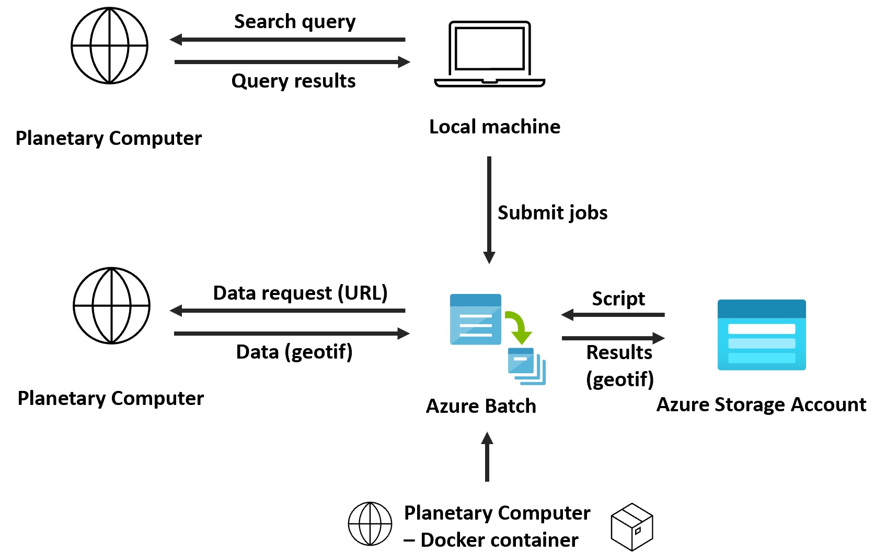
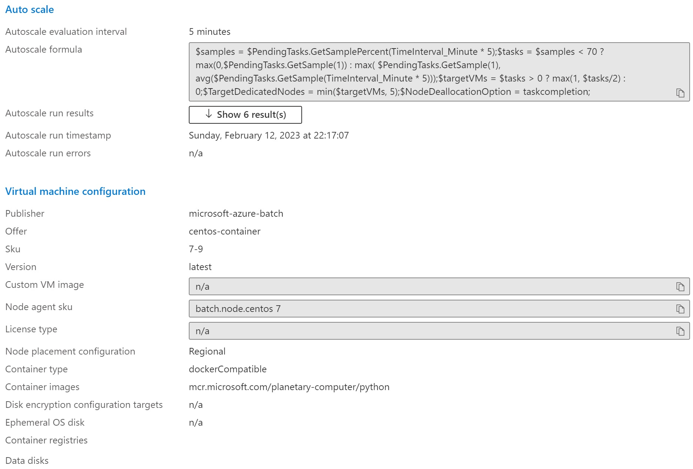

# Processing satellite data at scale with Azure Batch and Python

In this repository you will find the code to process satellite data from the [Planetary Computer](https://planetarycomputer.microsoft.com/) at scale with [Azure Batch](https://docs.microsoft.com/en-us/azure/batch/batch-technical-overview).

This repository is the technical back-bone from a [blog post](https://towardsdatascience.com/point-clouds-in-the-cloud-b7266da4ff25) where the concept of querying, selecting, and processing of satellite imagery with Azure Batch are explained.

As input data for this example we make use of an adaptable query based on the [STAC API, or Spatical Temporal Assets Catalog](https://stacspec.org/en) capabilities that are implemented in the Planetary Computer. The scripts defaults to a search filter selecting the ESA Sentinel 2 imagery stored on the Planetary Computer, an area of interest covering the Netherlands (as bounding bix), a max cloud coverage per scene of 100%, and a time interval starting 1 Feb. 2023 until the current data.

The actual processing contains the calculation of the NDVI (Normalized Difference Vegetation Index), which as division based on the red (band 4) and near infra red (band 8). Azure Batch will support the processing of all selected imagery and act as a job schedular on the provisioned pool. The Pool exists of a max number of virtual machines that will auto scale to perform the tasks and decommission when idle (in case the pool is set to auto scale, it also can be fixed on a certain size).

## General set-up

There are three steps to follow when the Azure Batch Python SDK is used to manage the Azure Batch processing with a local Python client:
1) local client upload application files to Azure Blob Storage, 
2) with the Python SDK of Azure Batch, the local client can start the creation of an Azure Batch Pool (although here already pre created, see pre-requisites), and then can add Azure batch jobs to run the imagery processing (the NDVI calculations), 
3) Azure Batch automatically schedules the job and tasks, execute the processing and upload output files to Azure Blob Storage.  

#### Pre-requisites:
You should have created the following resources:
-   an Azure Storage account with 2 blob containers: 
    - pc-application
    - batch-output
-   an Azure Batch account, including a pool. During the creation of the pool, make sure you make the reference to the pc-application as from this location the script to run on the cluster will be fetched. Also, allow containers, and make the reference to the [Planetary Computer docker registry](https://github.com/microsoft/planetary-computer-containers), namely: mcr.microsoft.com/planetary-computer/python. When you allow autoscaling you need to add an autoscaling formula. A pool setting example can be seen in below figure.

 

#### 1. Local client to upload to Azure Blob storage
The batch_python_ndvi.py runs locally as a client for Azure Batch and submits tasks to Azure Batch. Before the client can do this, some Azure service characteristics should be set in config_local.py. These are:
- the batch account name 
- batch account key
- batch account URL
Also storage account settings are needed to obtain a SAS token to provide to the tasks, so that Azure Batch is allowed to upload its results to the blob storage:
- storage account name
- storage account URL
- storage account key

To run the client locally, an environment with at least the following libraries installed is needed (see also requirements.txt):
- aazure-batch==13.0.0
- azure-storage-blob==12.14.1
- pystac==1.6.1
- pystac-client==0.6.0
- shapely==2.0.1 

#### 2. Local client to query the Planeatary Computer and submit job and tasks to Azure Batch Pool
Through the client, Azure Batch jobs and task can be submitted. Before doing so, the Planetary Computer STAC will be queries and with the resulting list of imagery, jobs are submitted (one per scene).

#### 3. Azure Batch processing
As with the submission of Azure Batch jobs, for each image scene fitting the query, the URL for specific bands are given as input for the Azure Batch task, and the batch_task_ndvi.py get executed. Azure Batch will schedule the job and task over the provisioned cluster automatically. The results, in this case the geotif files, will be uploaded to the Azure Blob container: batch-output.

#### Supporting tools
[Azure Storage Explorer](https://azure.microsoft.com/en-us/features/storage-explorer/): to interact with Azure storage
